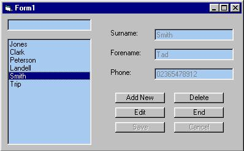



## A Simple Database Example

### Description

I have noticed recently, how many people have been going into the discussion forums and asking how to use databases.

well, this is a very simple example of how to manipulate data within databases

Functions include add, edit, and delete records, and a search by surname.

this code is fully commented.

please comment on this upload, as i would like to know what you think, and if you think there is a better way of doing certain things, argue it out all you like!

daz
 
### More Info
 

             |
---                |---
**Submitted On**   |2001-09-28 21:51:14
**By**             |[darren kurn](https://github.com/Planet-Source-Code/PSCIndex/blob/master/ByAuthor/darren-kurn.md)
**Level**          |Beginner
**User Rating**    |4.9 (311 globes from 64 users)
**Compatibility**  |VB 6\.0
**Category**       |[Databases/ Data Access/ DAO/ ADO](https://github.com/Planet-Source-Code/PSCIndex/blob/master/ByCategory/databases-data-access-dao-ado__1-6.md)
**World**          |[Visual Basic](https://github.com/Planet-Source-Code/PSCIndex/blob/master/ByWorld/visual-basic.md)
**Archive File**   |[A Simple D271359282001\.zip](https://github.com/Planet-Source-Code/darren-kurn-a-simple-database-example__1-27629/archive/master.zip)

